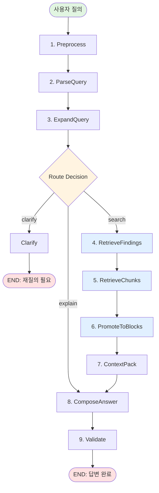
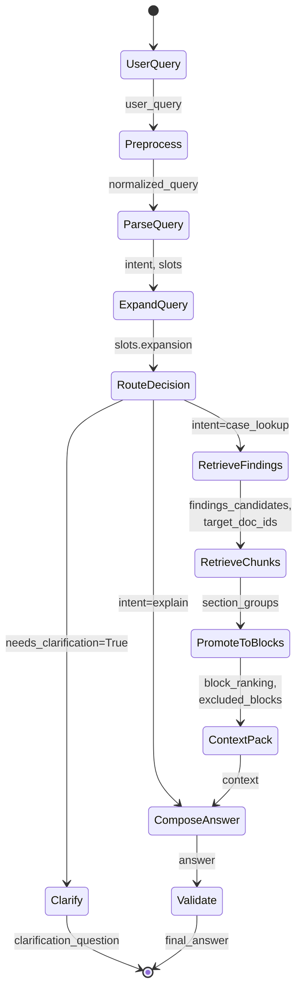
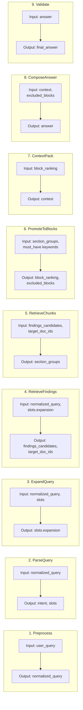
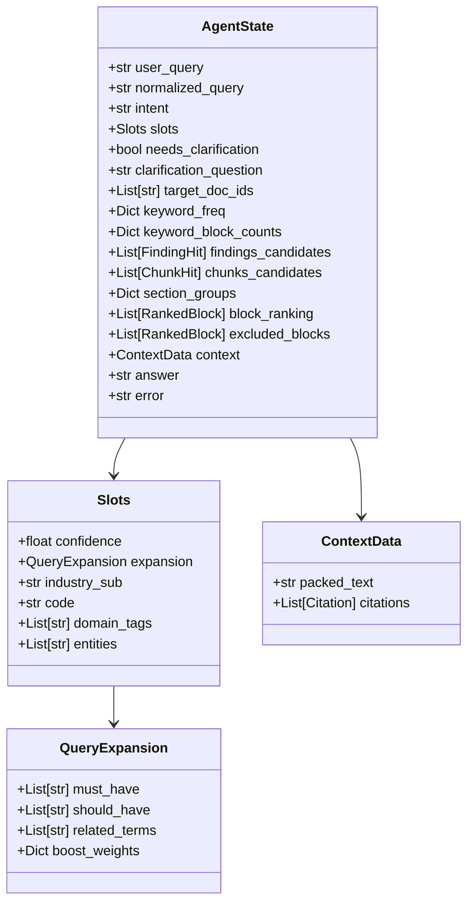
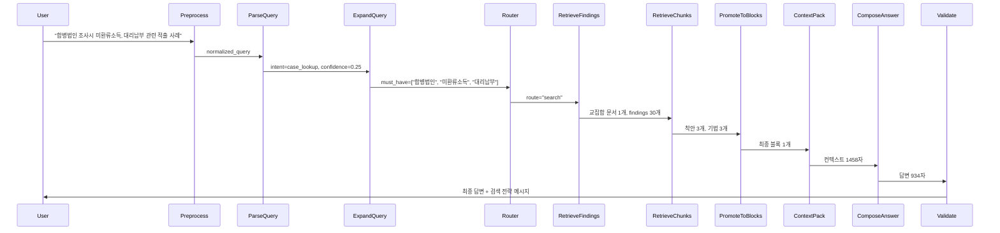
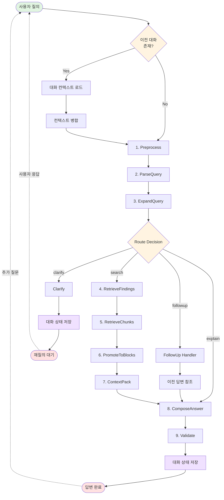

# LangGraph 에이전트 구조 시각화

## 전체 플로우

```mermaid
graph TD
    Start([사용자 질의]) --> A[1. Preprocess]
    A --> B[2. ParseQuery]
    B --> C[3. ExpandQuery]
    C --> D{Route Decision}
    
    D -->|clarify| E[Clarify]
    D -->|search| F[4. RetrieveFindings]
    D -->|explain| M[8. ComposeAnswer]
    
    E --> End1([END: 재질의 필요])
    
    F --> G[5. RetrieveChunks]
    G --> H[6. PromoteToBlocks]
    H --> I[7. ContextPack]
    I --> M
    M --> N[9. Validate]
    N --> End2([END: 답변 완료])
    
    style Start fill:#e1f5e1
    style End1 fill:#ffe1e1
    style End2 fill:#ffe1e1
    style D fill:#fff4e1
    style F fill:#e1f0ff
    style G fill:#e1f0ff
    style H fill:#e1f0ff
```

## State 흐름도

```mermaid
stateDiagram-v2
    [*] --> UserQuery
    
    UserQuery --> Preprocess: user_query
    Preprocess --> ParseQuery: normalized_query
    ParseQuery --> ExpandQuery: intent, slots
    ExpandQuery --> RouteDecision: slots.expansion
    
    RouteDecision --> Clarify: needs_clarification=True
    RouteDecision --> RetrieveFindings: intent=case_lookup
    RouteDecision --> ComposeAnswer: intent=explain
    
    Clarify --> [*]: clarification_question
    
    RetrieveFindings --> RetrieveChunks: findings_candidates,<br/>target_doc_ids
    RetrieveChunks --> PromoteToBlocks: section_groups
    PromoteToBlocks --> ContextPack: block_ranking,<br/>excluded_blocks
    ContextPack --> ComposeAnswer: context
    ComposeAnswer --> Validate: answer
    Validate --> [*]: final_answer
```

## 각 노드별 입출력

```mermaid
graph LR
    subgraph "1. Preprocess"
        A1[Input: user_query] --> A2[Output: normalized_query]
    end
    
    subgraph "2. ParseQuery"
        B1[Input: normalized_query] --> B2[Output: intent, slots]
    end
    
    subgraph "3. ExpandQuery"
        C1[Input: normalized_query, slots] --> C2[Output: slots.expansion]
    end
    
    subgraph "4. RetrieveFindings"
        D1[Input: normalized_query,<br/>slots.expansion] --> D2[Output: findings_candidates,<br/>target_doc_ids]
    end
    
    subgraph "5. RetrieveChunks"
        E1[Input: findings_candidates,<br/>target_doc_ids] --> E2[Output: section_groups]
    end
    
    subgraph "6. PromoteToBlocks"
        F1[Input: section_groups,<br/>must_have keywords] --> F2[Output: block_ranking,<br/>excluded_blocks]
    end
    
    subgraph "7. ContextPack"
        G1[Input: block_ranking] --> G2[Output: context]
    end
    
    subgraph "8. ComposeAnswer"
        H1[Input: context,<br/>excluded_blocks] --> H2[Output: answer]
    end
    
    subgraph "9. Validate"
        I1[Input: answer] --> I2[Output: final_answer]
    end
```

## State 데이터 구조

```mermaid
classDiagram
    class AgentState {
        +str user_query
        +str normalized_query
        +str intent
        +Slots slots
        +bool needs_clarification
        +str clarification_question
        +List[str] target_doc_ids
        +Dict keyword_freq
        +Dict keyword_block_counts
        +List[FindingHit] findings_candidates
        +List[ChunkHit] chunks_candidates
        +Dict section_groups
        +List[RankedBlock] block_ranking
        +List[RankedBlock] excluded_blocks
        +ContextData context
        +str answer
        +str error
    }
    
    class Slots {
        +float confidence
        +QueryExpansion expansion
        +str industry_sub
        +str code
        +List[str] domain_tags
        +List[str] entities
    }
    
    class QueryExpansion {
        +List[str] must_have
        +List[str] should_have
        +List[str] related_terms
        +Dict boost_weights
    }
    
    class ContextData {
        +str packed_text
        +List[Citation] citations
    }
    
    AgentState --> Slots
    Slots --> QueryExpansion
    AgentState --> ContextData
```

## 실행 예시 플로우

```mermaid
sequenceDiagram
    participant User
    participant Preprocess
    participant ParseQuery
    participant ExpandQuery
    participant Router
    participant RetrieveFindings
    participant RetrieveChunks
    participant PromoteToBlocks
    participant ContextPack
    participant ComposeAnswer
    participant Validate
    
    User->>Preprocess: "합병법인 조사시 미환류소득, 대리납부 관련 적출 사례"
    Preprocess->>ParseQuery: normalized_query
    ParseQuery->>ExpandQuery: intent=case_lookup, confidence=0.25
    ExpandQuery->>Router: must_have=["합병법인", "미환류소득", "대리납부"]
    Router->>RetrieveFindings: route="search"
    RetrieveFindings->>RetrieveChunks: 교집합 문서 1개, findings 30개
    RetrieveChunks->>PromoteToBlocks: 착안 3개, 기법 3개
    PromoteToBlocks->>ContextPack: 최종 블록 1개
    ContextPack->>ComposeAnswer: 컨텍스트 1458자
    ComposeAnswer->>Validate: 답변 934자
    Validate->>User: 최종 답변 + 검색 전략 메시지
```

## 멀티턴 대화를 위한 확장 구조 (제안)

```mermaid
graph TD
    Start([사용자 질의]) --> CheckHistory{이전 대화<br/>존재?}
    
    CheckHistory -->|Yes| LoadContext[대화 컨텍스트 로드]
    CheckHistory -->|No| A[1. Preprocess]
    
    LoadContext --> MergeContext[컨텍스트 병합]
    MergeContext --> A
    
    A --> B[2. ParseQuery]
    B --> C[3. ExpandQuery]
    C --> D{Route Decision}
    
    D -->|clarify| E[Clarify]
    D -->|search| F[4. RetrieveFindings]
    D -->|explain| M[8. ComposeAnswer]
    D -->|followup| O[FollowUp Handler]
    
    E --> SaveState1[대화 상태 저장]
    SaveState1 --> End1([재질의 대기])
    
    O --> P[이전 답변 참조]
    P --> M
    
    F --> G[5. RetrieveChunks]
    G --> H[6. PromoteToBlocks]
    H --> I[7. ContextPack]
    I --> M
    M --> N[9. Validate]
    N --> SaveState2[대화 상태 저장]
    SaveState2 --> End2([답변 완료])
    
    End1 -.->|사용자 응답| Start
    End2 -.->|추가 질문| Start
    
    style Start fill:#e1f5e1
    style End1 fill:#ffe1e1
    style End2 fill:#ffe1e1
    style CheckHistory fill:#fff4e1
    style D fill:#fff4e1
    style SaveState1 fill:#f0e1ff
    style SaveState2 fill:#f0e1ff
```

